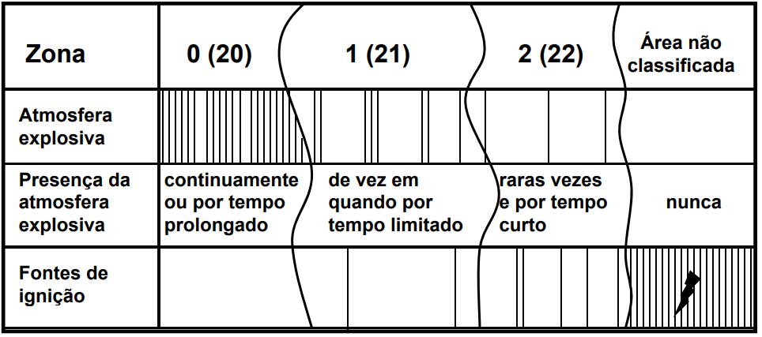
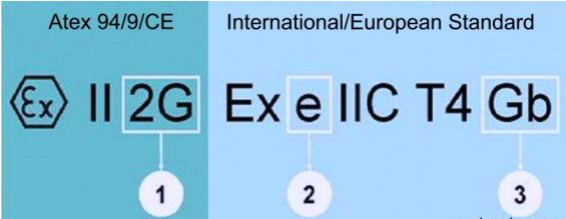

# Notes About Annelida Control Design 
# Explosive Atmospheres 
    - UE:
        - Equipment gorup II (Gases)  IEC / EN 60079-10-1.  
        - Zone 0 or 1 
- 
    - EEUU:
        - Class I, Division 1 
        - Category 1 or 2
    - Brazil:
        - Inmetro 
            - Portaria Inmetro nº 179, de 18 de maio de 2010 
            - Portaria INMETRO / MDIC número 89 de 23/02/2012 (modifica  nº 179, de 18 de maio de 2010)
        - Ncc certificações do brasil: WILSON BONATO wilson.bonato@ncc.com.br
        - Petrobras: ROBERVAL BULGARELLI bulgarelli@petrobras.com.br
    - Feasible Options:

| Ex code | Description          | Standar                 | Zone                  | Use         |
| ------- | -------------------- | ----------------------- | --------------------- | ----------- |
| m       | Encapsulated (resin) | IEC/EN 60079-18         | 1 \| 0                | electronics |
| p       | Pressurised          | IEC/EN 60079-2          | 1 (px \| py) \| 2 pz  | Computers   |
| i       | Intrinsically safe   | IEC/EN 60079-25 -11 -27 | 'ai': 0 'ib': 1 ic: 2 | Control     |
| o       | Oil Filled           | IEC/EN 60079-6          | 2 \| 1                | switchgear  |
| e       | Increased Safety     | IEC/EN 60079-7          | 2 \| 1                | Control     |

   - Other Protections:

| Ex code | Description      | Standar        | Zone   | Use                           |
| ------- | ---------------- | -------------- | ------ | ----------------------------- |
| d       | Flameproof       | IEC/EN 60079-1 | 1      | electronics, lighting, motors |
| q       | Sand Filled      | IEC/EN 60079-5 | 2 \| 1 | electronics, telephones       |
| n       | Non Incendive    | IEC/EN 60079-6 | 2      | electronics, equipment        |

- The types of protection are subdivided into several sub classes, linked to EPL (EQUIPMENT PROTECTION LEVEL): ma and mb, px, py and pz, ia, ib and ic. The a subdivisions have the most stringent safety requirements, taking into account more the one independent component faults simultaneously.

| Zone | Level     | ATEX | EPL |
| ---- | --------- | ---- | --- |
| 0    | Very High | 1G   | Ga  |
| 1    | High      | 2G   | Gb  |
| 2    | Normal    | 3G   | Gc  |
| 20   | Very High | 1D   | Da  |
| 21   | High      | 2D   | Db  |
| 22   | Normal    | 3D   | Dc  |

- EPL Ga: Equipment for explosive atmospheres due to the presence of gas, with a level of
protection 'very high', which is not a source of ignition in normal operation, or in case of expected
failure or when subjected to a rare failure.

- EPL Gb: Equipment for use in explosive atmospheres due to the presence of gas, with a 'high'
level of protection that is not the source of ignition in normal operation or when subject to expected
malfunctions, although not on a regular basis.

- EPL Gb: Equipment for use in explosive atmospheres due to the presence of gas, with a 'high'
level of protection that is not the source of ignition in normal operation or when subject to expected
malfunctions, although not on a regular basis.

- EN 60079-14 standard of March 2010 introduced a method for risk assessment that considers the
equipment levels of protection (EPL).

## Standars for explosive atmospheres

* EUROPEAN COMMISSION **2014/34/EU** ATEX CE + Ex [From 20 April 2016]
    * Directive 2014/34/EU of the European Parliament and of the Council of 26 February 2014 on the harmonisation of the laws of the Member States relating to equipment and protective systems intended for use in potentially explosive atmospheres (recast)
    * For further information on the ATEX Directive 2014/34/EU on Equipment and protective systems please visit the Directorate-General (DG) for Internal Market, Industry, Entrepreneurship and SMEs website dedicated to this sector by following this link: http://ec.europa.eu/growth/sectors/mechanical-engineering/atex_en
    * For a further look at the harmonised standards for ATEX, please visit: http://ec.europa.eu/growth/single-market/european-standards/harmonised-standards/equipment-explosive-atmosphere_en
    * Reference: https://ec.europa.eu/growth/single-market/ce-marking/manufacturers_en

## Our requirements

Many modern devices will carry both ATEX and IECEx approval, and so the label will display codes and information from both schemes. Some of that information is common, some is not. A typical ATEX and IECEx label is shown below.

## Highliths 

1. It must be purposely-designed for use within an explosive atmosphere at normal temperatures and pressures.
2. The atmosphere may contain gas, vapour, mist or dust as a fuel, but must be based on air as the oxidiser. 
3. The equipment must have an ignition source in and of itself, such as a spark, hot surface, etc.

Because of these criteria, simple items such as hammers are not covered as they do not generate sparks in and of themselves (only when struck against another item), and some mechanical devices such as hand-operated valves are excluded under statements issued by the EEC, as they are not considered to move fast enough to generate any frictional heat sufficient to cause ignition. 

# Prototype Design

## Components

All components were listed in google sheets to be purchased.
But yet I have to define the material to enclose all the control.

- [PT] Dependendo das dimenções dos componentes é necessario fazer um corte laser

