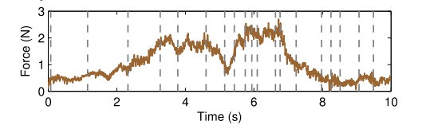

# Notes On "Integrating Physics-based and Data-Driven Methods to Accurately Model Haptic Textures"  Steeven Villa


## Mar 2018

--Slide1

### Last definitions

- Force Will be induced with springs
- Initial measurements without force sensor
- Track movement and velocity with camera (~250 fps)

### To-Do

* [ ] Design A base that holds up the Mechanism. [Ongoing]
* [ ] Adapt Accelerometer [Ongoing]
* [x] Search for a feasible force sensor
* [ ] Buy a Driver


--Slide2

### Main requeriments

#### Repeatability

as our measurements are repetitive and almost constant around a value, it is important to take into accoun the repeatability capacity of the force sensor. The more accurate a sensor is the less reapeatability error it has.
Repeatability error is evaluated by measuring the same force and evaluating the output values of the sensor


#### Hysteresis

The hysteresis error of a pressure sensor is the maximum difference in output at any measurement value within the sensor’s specified range when approaching the point first with increasing and then with decreasing pressure.


#### Force range

Mean forces in texture modeling [CUL2014]:



--Slide3

### How accurate nano 17 is?
I asked directly in ATI Technologies for their Nano17 sensor. the cost of this device is 5500 USD (including Capture device DAQ). Due its cost I asked the vendor to give me cheaper options and she gave me the Axia80 datasheet. A bigger sensor that does not meet our requeriments at price of 3500 USD.

Nano 17 info [GUO2016]:


- Sensing Range: $\pm 8 N$
- Resolution: $ 1/682 N$
- hysteresis: No data.
- Repeatability: High
- Diameter: $17 mm$

--Slide4

### Options
#### Variense Digital Triaxial Force Sensor (FSE103) \{800 USD}

Closest option, 3 axis

- Sensing range: $0-100 N$
- Resolution: No data.
- Hysteresis No data.
- Repeatability: High
- Diameter: $39 mm$


https://www.robotshop.com/en/variense-digital-triaxial-force-sensor-fse103.html

#### Interlink Electronics 0.2" Circular FSR \{6.08 USD}

- Sensing range: $0.2-20 N$
- Resolution: Continuous.
- Hysteresis: $\pm 10\%$.
- Repeatability: High $\pm 2\%$
- Diameter: $5.6 mm$ $13 mm$


https://www.robotshop.com/en/interlink-electronics-circular-fsr-short-34-00004.html

#### 100g Micro Load Cell \{7 USD}

- Sensing range: $0-100g \approx4.8N $
- Resolution: Continuous.
- Hysteresis: $>1\% \approx 50mg$.
- Repeatability: High $>1\% \approx 50mg$.
- Dimensions: $35mm \times12mm \times4mm$


https://www.robotshop.com/en/100g-micro-load-cell.html

#### Capacitive Force Sensor \{18 USD}

- Sensing range: $0-4.5 N$
- Resolution: $< 0.2\% of Full Scale$.
- Hysteresis: $>4\%$.
- Repeatability: High $>1\%$
- Diameter: $15 mm$

i2c Interface, Digital DAQ
[{28USD}](https://www.robotshop.com/en/capacitive-force-sensor-electronics-daq-analog-i2c-output.html):


https://www.robotshop.com/en/capacitive-force-sensor-15-mm-45-n-1-lbs.html

### Proposal

We could try to use a resistive sensor (4mm of diameter). It can measure force from 0.1N to 10N depending on the pressure in the measuring region. it is not very accurated but can give us information to start working.

 

- #### Design a Base that holds up the mechanism

I Started Designin the base. I Drew a sample part ```Mountv1.stl``` to test the new 3D printer. I found difficulties when trying to print. First i found that the standar software of BCN3D does not print over usb but only over SD. So I Searched for a software to print. I downloaded Simplify3D (Propietary software that needs to be licenced) and tryed to configure all the printer parameters, I got printed the test part and it fits in the structure. It need to be refined

We need to think in the weigth of the base, it must be higher than the force applied to the texture because it could lift the structure and skewing the measurements

- #### Adapt Accelerometer and Springs

To adapt accelerometer we need to define how the tool will be built. I will start to design our own tool taking into account the resistive force sensor (by now). Its diameter is fo 4mm and can

- #### Configure the camera


Bib

* [CUL2014] Culbertson, H., Unwin, J., & Kuchenbecker, K. J. (2014). Modeling and rendering realistic textures from unconstrained tool-surface interactions. IEEE Transactions on Haptics, 7(3), 381–393. https://doi.org/10.1109/TOH.2014.2316797

* [GUO2016] Guo, J., Li, M., Ho, P., & Ren, H. (2016). Design and Performance Evaluation of a Force/Torque Sensor for Tele-Operated Catheterization Procedures. IEEE Sensors Journal, 16(9), 3208–3215. https://doi.org/10.1109/JSEN.2016.2522657